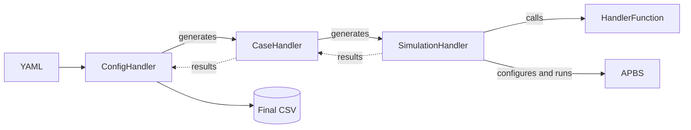
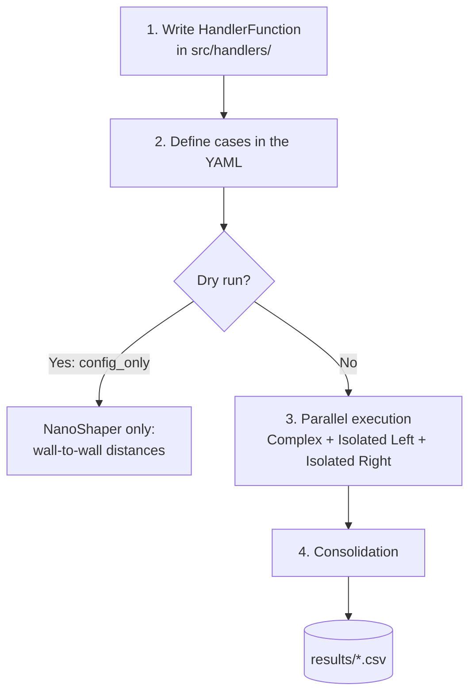

# apbsHelper

A Python tool to configure, run, and consolidate electrostatic simulations with [APBS](https://www.poissonboltzmann.org/) in order to compute **interaction energy curves** between two molecules (for example, two RNA strands) for different geometries, orientations, separation distances, grids, and so on.

Starting from **a base PDB** and **a YAML configuration file**, the code:

1. Modifies the PDB according to your parameters (rotations, separation distances, atom selections, etc.).
2. Generates the PQR files with PDB2PQR.
3. Runs the APBS simulations **in parallel**.
4. Computes the interaction energy (including the Coulomb energy).
5. Consolidates everything into a **single CSV file** ready for further analysis.

## Acknowledgements

This project was made in the context of an undergraduate Mechanical Engineering thesis at the [Numerical Molecular Modeling Group at USM](https://bem4solvation.github.io/), Valparaíso, Chile. Special thanks to Dr. Christopher Cooper at USM and Dr. Simon Poblete at Ciencia & Vida for their guidance and mentorship, and for both their sharp eye for bugs and attention to detail which guided the development of this tool. Without them, this project could've never come to fruition. Many thanks to Dr. Cooper for his work on apbs_tool which is used extensively in this tool, all credits go to him.

## Some Notes

The project contains two branches: master and yukawa_potential. The latter is the final and newer version of the project and should be preferred while the former is an earlier build which may contain unresolved bugs. Proceed with caution.

---

## Contents

- [Key concepts](#key-concepts)
- [Architecture](#architecture)
- [Project structure](#project-structure)
- [Requirements](#requirements)
- [Usage workflow](#usage-workflow)
- [YAML file reference](#yaml-file-reference)
- [Writing your own HandlerFunction](#writing-your-own-handlerfunction)
- [Coarse-grained models](#coarse-grained-models)
- [Outputs](#outputs)
- [Modifying and extending the tool](#modifying-and-extending-the-tool)
- [Troubleshooting](#troubleshooting)

---

## Key concepts

| Term | Meaning |
|---|---|
| **Case** | A set of related simulations. E.g., one specific RNA orientation at several distances. |
| **Simulation** | A specific point within a case (e.g., one particular distance). Each element of `variants` generates one simulation. |
| **Complex / isolated configuration** | Computing an interaction energy requires **at least 3 APBS runs**: *Complex* (both molecules together), *Isolated Left*, and *Isolated Right*. The tool orchestrates this logic automatically. |
| **Handler** | A user-written function that reads the base PDB, modifies it, and writes the resulting PDB/PQR files. |
| **`base` vs `variants`** | `base`: parameters applied to **all** simulations of the case. `variants`: parameters that generate the different simulations of the case. |

---

## Architecture

The project uses an object-oriented structure with clearly defined responsibilities:



| Class | Responsibility |
|---|---|
| **`ConfigHandler`** | Reads and validates the YAML, generates the `CaseHandler` objects, and consolidates the results of all cases for a given PDB into a single CSV. |
| **`CaseHandler`** | Generates, groups, and runs **in parallel** multiple related `SimulationHandler` instances (e.g., one orientation at different distances). Handles the Complex / Isolated Left / Isolated Right logic. |
| **`SimulationHandler`** | Calls the user's handler, configures the simulation, runs **one** APBS simulation, and retrieves its results. Includes the Coulomb energy calculation used to obtain the interaction energy. |
| **`HandlerFunction`** | A placeholder (abstract) class that defines the structure, inputs, and outputs that the user-written handler function must follow. |

**Relationships:**

- A YAML file can have **multiple cases** (`CaseHandler`).
- Each case can have **multiple simulations** (`SimulationHandler`).
- Each simulation includes its *Complex* and *Isolated* variants.

---

## Project structure

```
.
├── src/
│   ├── classes/      # ConfigHandler, CaseHandler, SimulationHandler, HandlerFunction
│   ├── handlers/     # User-written HandlerFunctions
│   └── utils/        # Helper tools (e.g., APBS .in file generation,
│                     # PQR generation, coarse-grained PQR)
├── pdbFiles/         # Base PDBs (see `pdb_directory` in the YAML)
├── data/             # Simulation files (one folder per YAML > case > simulation)
└── results/          # Final CSVs, cataloged by date, YAML name, and unique ID
```

**`data/` folder:** a top-level folder is created for each configuration file, using the `name` given in the YAML. Inside it live the cases, and inside each case the folders of its simulations.

```
data/
└── rna_example_config/
    ├── case_01/
    │   ├── <simulation 1 folder>/
    │   └── <simulation 2 folder>/
    └── case_02/
        └── ...
```

---

## Requirements

**Python libraries**

- `pandas`, `numpy`, `scipy`
- `MDAnalysis`
- `pyyaml` (YAML parsing)

**External software**

- [APBS](https://www.poissonboltzmann.org/)
- [PDB2PQR](https://pdb2pqr.readthedocs.io/) (used inside the HandlerFunction to generate the PQR files APBS requires)
- NanoShaper (used to obtain wall-to-wall distances)

> ⚠️ The example handler contains a **hard-coded absolute path to `pdb2pqr.py`**. Adjust it to match your installation.

```bash
pip install pandas numpy scipy MDAnalysis pyyaml
```

---

## Usage workflow

This is the complete flow, from start to finish.

### 1. Write your `HandlerFunction`

The handler is the piece that adapts the tool to **your** system. It takes a base PDB and modifies it however you need: rotate it, separate it, add or remove atoms, etc. **Any modification MDAnalysis can perform is possible here.**

- It is written as a subclass of `HandlerFunction`.
- It is saved in `src/handlers/`.
- See [Writing your own HandlerFunction](#writing-your-own-handlerfunction) for the full input/output contract.

### 2. Define the cases in the YAML

Create **one YAML file per base PDB** to simulate. In it you define:

- Which handler to use and which base PDB to process.
- Global simulation options (grid, PB equation type, etc.).
- The cases to run and, within each, which simulations compose it.

Typical case examples:

- One specific orientation at **different distances**.
- The same distance with **different orientations**.
- A combination of both.

> **Golden rule:** each element of the `variants` field (under `handler_options`) corresponds to **one simulation** of the case. Anything under `base` applies to **all** simulations of the case.

### 3. Run

Before launching a large sweep, you can opt for a **configuration-only / *dry run* mode**, in which full APBS runs are skipped and only NanoShaper is executed to obtain the **wall-to-wall distances**, an important parameter for analysis (in the YAML: `config_only: true`).

When you run the tool, the following happens internally:

1. The YAML is read and **validated**.
2. The **Case** instances are generated.
3. Each case generates its **simulation** instances, including its *Isolated* and *Complex* variants.
4. Each simulation calls your handler, generates the PQR, and runs APBS.
5. All of this runs **in parallel**: you can run 1, 2, 3, or more APBS instances simultaneously (`max_threads` in the YAML).

```bash
python apbsHelper.py configs/example.yaml
```

### 4. Result collection

As simulations finish:

1. Each `CaseHandler` compiles the results of its simulations.
2. It hands them to the `ConfigHandler`.
3. The `ConfigHandler` consolidates **all cases** into a single CSV inside `results/`.

> ⏱️ This last step may take a while: it is not fully optimized yet.

### Visual summary of the workflow



---

## YAML file reference

**One YAML per base PDB** is used. Below is the full commented example:

```yaml
name: rna_example_config          # Name; defines the top-level folder in data/

config_only: false                # true = configure only (dry run), do not run full APBS
log_level: info
max_threads: 2                    # Max number of parallel APBS simulations

cases_to_run:                     # Cases to execute (must exist under `cases`)
    - case_01
    - case_02
    - case_03

pdb_handler: src.handlers.example_handler.TestHandler   # Subclass of HandlerFunction
pdb_directory: pdbFiles
core_pdb_filename: example_2rna.pdb                     # Base PDB

# ---- Global options (overridden by each case's own options) ----
global_sim_options:
    mesh_size: 0.9
    coarse_grain: false
    linear_pb: false
    keep_complex_dx: false

global_handler_options:
    base:                         # Applies to all simulations of the case
        cg_charges: [[-10]]
        rotation_angle: 0
    variants:
        distance: [0, 15]         # Each element = one simulation

# ---- Case definitions ----
cases:
    - name: case_01
      sim_options:                # Overrides global_sim_options
        coarse_grain: true
        linear_pb: true
        keep_complex_dx: false
      handler_options:
        base:
            cg_charges: [[-10]]
            rotation_angle: 90
        variants:
            distance: [0, 10]
            atom_set: ['A', 'B']  # Additional variants

    - name: case_02
      sim_options:
        coarse_grain: true
        linear_pb: false
        keep_complex_dx: false
      handler_options:
        base:
            rotation_angle: 120
            test_option: ExampleTest
```

### Top-level fields

| Field | Description |
|---|---|
| `name` | Configuration name. Defines the folder in `data/` and appears in the results CSV name. |
| `config_only` | If `true`, only configures (*dry run* mode) without running full APBS. |
| `log_level` | Logging level (e.g., `info`). |
| `max_threads` | Maximum number of APBS simulations to run in parallel. |
| `cases_to_run` | List of cases to execute. |
| `pdb_handler` | Dotted Python path to the handler class. **Must be a subclass of `HandlerFunction`.** |
| `pdb_directory` | Folder containing the base PDB. |
| `core_pdb_filename` | Name of the base PDB file. |

### Simulation options (`sim_options`)

| Option | Description |
|---|---|
| `mesh_size` | Grid size. |
| `coarse_grain` | Enables the coarse-grained model (see [section](#coarse-grained-models)). |
| `linear_pb` | Linear (`true`) or nonlinear (`false`) Poisson-Boltzmann equation. |
| `keep_complex_dx` | Keeps the complex's DX files. **They take up a lot of disk space.** |

### Handler options (`handler_options`)

The keys under `handler_options` are **free-form**: they are passed **unmodified** to the handler function you wrote, so you can define whatever parameters you need (`rotation_angle`, `distance`, `test_option`, etc.).

- **`base`**: applies to all simulations of the case.
- **`variants`**: defines the simulations of the case. Each point = one simulation.

> `variants` also supports a *pairwise* form using a list of dictionaries, for example: `[{'distance': 0, 'atom_set': 'A'}, {...}]`.

### Global vs. per-case option inheritance

`global_handler_options` and `global_sim_options` define **default** values for all cases. They apply **as long as the case does not have its own** `handler_options` / `sim_options`. If the case defines them, they **override** the global ones. This way you avoid repeating the same settings in every case.

---

## Writing your own HandlerFunction

A handler is a class that inherits from `HandlerFunction` and implements the `handle` method.

### Contract

```python
def handle(
    self,
    core_pdb: str,              # Path to the base PDB
    target_dir: str,            # Working directory where results must be written
    handler_options: Dict,      # Options from the YAML (base + variant), unmodified
    coarse_grain: bool = False  # Whether a coarse-grained model is used
) -> Tuple[Path, Dict[str, List[str]]]:
    ...
```

**Inputs**

- `core_pdb`: path to the base PDB.
- `target_dir`: working directory of the simulation.
- `handler_options`: dictionary with the options defined in the YAML.
- `coarse_grain`: flag taken from `sim_options`.

**What the handler MUST do**

1. Read the base PDB and modify it as needed.
2. Write **three PDB files** to `target_dir`: the complex (both molecules together) and each molecule separately (**Complex, Isolated 1, and Isolated 2**, using the `left_` / `right_` convention).
3. Run **PDB2PQR** to generate the files APBS requires.
4. If `coarse_grain` is `True`, modify the resulting PQR (charges and radii) using the coarse-grained model.

**Output**

A tuple `(Path, dict)`:

- `Path`: file name of the complex PDB.
- `dict`: which chains belong to each molecule, e.g. `{'left': ['D', 'F'], 'right': ['C', 'E']}`.

### Commented example

The `example_handler.py` file separates two RNA molecules by a given distance and rotates one of them:

```python
class TestHandler(HandlerFunction):

    def handle(self, core_pdb, target_dir, handler_options, coarse_grain=False):
        # 1. Read parameters defined in the YAML
        rot_angle = handler_options['rotation_angle']
        distance  = handler_options['distance']

        # 2. Load the PDB and split into "left" and "right" molecules by chain
        pdb   = mda.Universe(core_pdb)
        left  = pdb.select_atoms('chainID D or chainID F')
        right = pdb.select_atoms('chainID C or chainID E')

        # 3. Separate: only "right" moves, along the axis joining the
        #    centers of mass. "left" stays fixed.
        ...

        # 4. Rotate "right" around its third principal axis
        ...

        # 5. Write the three PDB files (complex, left, right)
        u = mda.Merge(left.atoms, right.atoms)
        u.atoms.write(os.path.join(target_dir, out_pdb_filename))
        left.atoms.write(os.path.join(target_dir, left_out_pdb_filename))
        right.atoms.write(os.path.join(target_dir, right_out_pdb_filename))

        # 6. Generate PQR files with PDB2PQR
        apbs_tool.generate_pqr_files(target_dir, '/path/to/pdb2pqr.py')

        # 7. (Optional) Replace the PQR with a coarse-grained model
        if coarse_grain:
            ...
            tools.create_pqr_cg(os.path.join(target_dir, pqr_com), cg_pos, cg_chg)

        # 8. Return the complex PDB and the chain assignment
        chains = {'left': ['D', 'F'], 'right': ['C', 'E']}
        return Path(out_pdb_filename), chains
```

To use it, reference the class in the YAML:

```yaml
pdb_handler: src.handlers.example_handler.TestHandler
```

### Steps to create a new one

1. Create `src/handlers/my_handler.py`.
2. Define `class MyHandler(HandlerFunction)` and implement `handle(...)` following the contract above.
3. Read the parameters you need from `handler_options` (you choose the names).
4. Point `pdb_handler` in the YAML to `src.handlers.my_handler.MyHandler`.
5. Define those same parameters under `base` / `variants` in the YAML.

---

## Coarse-grained models

With `coarse_grain: true` in `sim_options`, the handler receives `coarse_grain=True` and can **replace the atomic charges and radii** in the PQR created by PDB2PQR to simulate a coarse-grained model.

In the example, `coarse_grain_rna` groups every 5 base pairs into a single center and assigns it a charge (taken from `cg_charges` in `handler_options`); then `tools.create_pqr_cg(...)` rewrites the PQR with those positions and charges.

---

## Outputs

- **Simulation files:** in `data/<yaml_name>/<case>/<simulation>/`.
- **DX files:** only kept if you enable it (`keep_complex_dx: true`), since they take up a lot of space.
- **Final results:** in `results/`, one CSV per run, cataloged by **date**, **YAML name**, and a **unique identifier**. It contains the interaction energies for all cases of the studied PDB, ready for analysis with pandas.

---

## Modifying and extending the tool

| I want to... | What to touch |
|---|---|
| Change the geometry / orientation / system | Write a new handler in `src/handlers/` |
| Add a custom parameter to the handler | Add it under `handler_options` (YAML) and read it in `handle()`; no changes elsewhere are needed |
| Change parameters of the APBS `.in` file | Files in `src/utils/` where the APBS input is defined |
| Try a different coarse-grained model | Implement it in the handler and use `create_pqr_cg` (or your own function) to rewrite the PQR |
| Sweep more distances or orientations | Extend the `variants` lists in the YAML |
| Change how results are consolidated | `ConfigHandler` (final consolidation) and `CaseHandler` (per-case) |

---

## Troubleshooting

- **Handler not found:** check that `pdb_handler` uses the dotted module path (`src.handlers.file.Class`) and that the class inherits from `HandlerFunction`.
- **PDB2PQR fails:** verify the path to `pdb2pqr.py` used in the handler.
- **Too much disk usage:** keep `keep_complex_dx: false` unless you need the maps.
- **A case does not run:** confirm its name is in `cases_to_run` and exists under `cases`.
- **Final consolidation is slow:** this is a known behavior; the step is not fully optimized yet.
